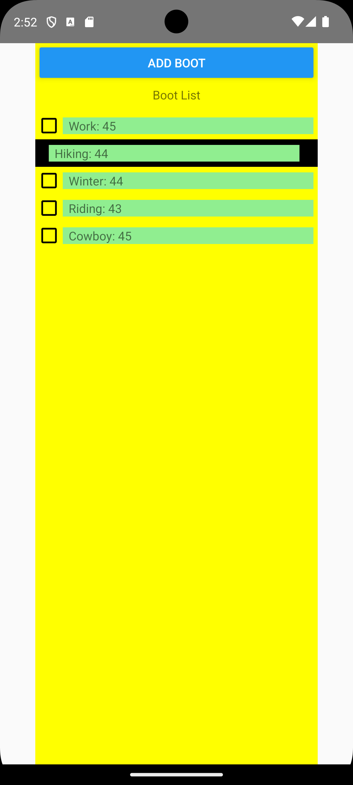

Pitäisikö laittaa flatlist kaikkinenn komponentiksi (jolloin  swipeable, sekä checkbox samassa), samoin deleteAlert sekä 
Emulaattorissa voi kamera ikoni napsia kuvi näytöstä

Work
Hiking
Winter
Rain
Snow
Cowboy
Riding


## use cases

## Local DataBase

./db.js was provided

## AddItem


./App.js
```
<Button
   title="add boot"
   onPress={() => {setVisibility(true);}}
/>
```

./AddBoot.js
Modal
-> addItem (App.js)
   -> saveBoot
      addBoot (db.js)    

## UpdateItem

onPress
Winter boot size is changed from 45 to 44


Flatlist
  renderBoot 
  onPress={() => updateItemModal(index)}

./UpdateBoot.js
Modal
-> updateItem (App.js)
  -> updateBootInDb
     updateBoot (db.js)
     

## DeleteItem/ArchiveItem by Alert component
db:n tauluun boots lisätty archive kenttä, arvo joko 0 tai 1

Delete


Archive


Flatlist
  renderBoot 
  onLongPress={()=>deleteAlert(index)}
    
    archive -> onPress: () =>updateBootInDb(bootList[index].id, bootList[index].type, bootList[index].size, 1) (archive = 1)
                              updateBoot (db.js)

    ok -> onPress: () => deleteItem(bootList[index].id)}
                             removeItemFromSelectedList(id);
                             deleteBootFromDb(id); 
                                 deleteBoot(id) (db.js)

## DeleteItem by swipe





if item is selected by checkbox it will be removed from selectedlist too.

import { GestureHandlerRootView, Swipeable } from 'react-native-gesture-handler';


<GestureHandlerRootView style={{ flex: 1 }}>
   <FlatList


FlatList
renderBoot 
<Swipeable renderRightActions={renderRightActions} onSwipeableOpen={() => handleSwipeableOpen(item.id)}>


UI for swipeable
const renderRightActions = (progress, dragX) => {
      
      return (
        <View style={styles.rightAction}>
          <Text style={styles.actionText}> will be deleted </Text>
          
        </View>

      );
    };


handleSwipeableOpen
      setBootList([]);
      deleteItem(id);
            removeItemFromSelectedList(id);
           deleteBootFromDb(id);  
               deleteBoot(id); (db.js)


## Delete selected items (checkbox)

When some item selected delete button will be shown otherwise delete button is not shown.


import CheckBox from '@react-native-community/checkbox';

OBJECT type
const [selectedItems, setSelectedItems] = useState({});  

FlatList
renderBoot

<CheckBox
   onValueChange={() => toggleCheckbox(item.id)}
                       setSelectedItems (useState set)  

   value={selectedItems[item.id]}  (checked or not)

if some checked button delete will appear <(tähän kuva)>
TEE Aniomation gif!!!!!

{hasCheckedItems && (
            <View style={styles.buttonStyle}>
              <Button
                title="delete"
                onPress={() => {
                  deleteSelectedItems();
                }}
              />
            </View>
)}

Button
   onPress={() => { deleteSelectedItems()}};
                        loop
                         deleteItem(id);
                           removeItemFromSelectedList(id);
                                 deleteBootFromDb(id);  
                                       deleteBoot(id); (db.js)


## update fatList


useEffect

dependency (muuttuja updateList)

```
useEffect(() => {  
    readAllBoot();
  }, [updateBootList]);
```

setBootList will be caused the rerendering the display

readAllBoot
  const dbResult = await fetchAllBoot();
  setBootList(dbResult);
    
luetaan kannasta kaikki tiedost taulusta boots ja asetetaan useState muuttujaan 


--------------------------------------------------------
